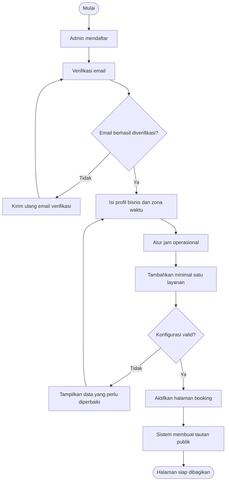
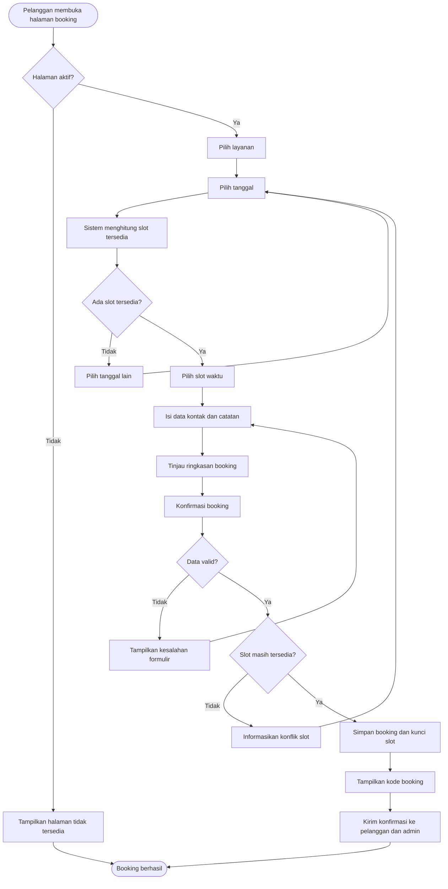
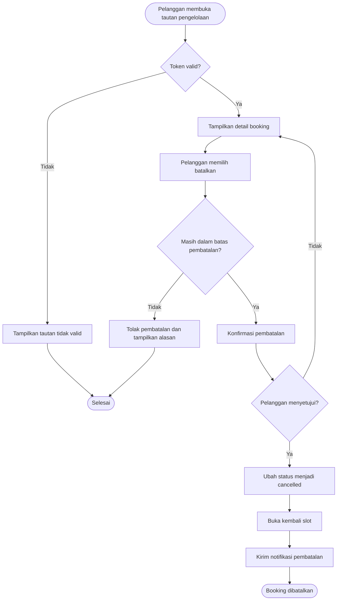

# Product Requirements Document — Mini Booking SaaS

| Atribut | Detail |
|---|---|
| Nama produk | Mini Booking SaaS |
| Versi dokumen | 1.0 |
| Status | Draft |
| Tanggal | 19 Agustus 2026 |
| Target rilis | TBD |
| Pemilik produk | TBD |

## 1. Ringkasan Produk

Mini Booking SaaS adalah aplikasi berbasis web yang membantu bisnis jasa menerima dan mengelola reservasi secara online. Pemilik bisnis dapat membuat halaman booking publik, mengatur layanan dan jam operasional, serta melihat dan memperbarui status reservasi melalui dashboard sederhana.

Produk difokuskan untuk usaha kecil seperti barbershop, salon, studio kecantikan, klinik kecil, tempat les, konsultan, fotografer, dan penyedia jasa lain yang masih mengelola janji temu melalui chat atau pencatatan manual.

## 2. Latar Belakang

Banyak usaha kecil menerima reservasi melalui WhatsApp, telepon, atau pesan media sosial. Proses tersebut menimbulkan beberapa masalah:

- Pemilik bisnis harus berulang kali menjawab pertanyaan tentang jadwal yang tersedia.
- Risiko jadwal bentrok dan kesalahan pencatatan cukup tinggi.
- Pelanggan tidak dapat melakukan booking di luar jam kerja.
- Informasi pelanggan dan riwayat reservasi tersebar di beberapa kanal.
- Produk booking yang sudah ada sering terlalu kompleks atau mahal untuk usaha kecil.

Mini Booking SaaS menyediakan proses reservasi yang ringkas, mudah digunakan, dan dapat diaktifkan tanpa konfigurasi teknis.

## 3. Visi Produk

Menjadi solusi booking paling sederhana bagi usaha jasa kecil untuk mulai menerima reservasi online dalam waktu kurang dari 10 menit.

## 4. Tujuan dan Sasaran

### 4.1 Tujuan MVP

- Memungkinkan bisnis membuat halaman booking publik sendiri.
- Memungkinkan pelanggan memilih layanan, tanggal, dan slot waktu yang tersedia.
- Mencegah dua reservasi menggunakan slot yang sama.
- Memusatkan pengelolaan reservasi dalam satu dashboard.
- Mengirim konfirmasi setelah reservasi dibuat.

### 4.2 Sasaran Bisnis

- Mendapatkan 100 bisnis terdaftar dalam tiga bulan pertama.
- Mencapai minimal 30% bisnis aktif mingguan dari total bisnis terdaftar.
- Mencapai minimal lima booking berhasil per bisnis aktif per bulan.
- Mengonversi minimal 5% akun gratis menjadi pelanggan berbayar dalam enam bulan.

### 4.3 Bukan Tujuan MVP

- Menjadi sistem ERP atau POS lengkap.
- Mendukung marketplace lintas bisnis.
- Menyediakan manajemen inventori.
- Menyediakan payroll atau komisi staf.
- Mendukung pembayaran split atau settlement kompleks.
- Menyediakan aplikasi mobile native.

## 5. Target Pengguna

### 5.1 Pemilik atau Admin Bisnis

Pemilik usaha kecil yang mengelola jadwal dan reservasi sendiri atau bersama tim kecil.

Kebutuhan utama:

- Setup cepat tanpa bantuan teknis.
- Jadwal reservasi yang rapi dan mudah diperiksa.
- Pengurangan komunikasi manual dengan pelanggan.
- Pencegahan double booking.

### 5.2 Pelanggan

Orang yang ingin membuat janji dengan sebuah bisnis melalui tautan publik.

Kebutuhan utama:

- Melihat slot yang benar-benar tersedia.
- Melakukan booking tanpa membuat akun.
- Mendapatkan konfirmasi dan detail reservasi.
- Membatalkan booking dengan mudah jika diizinkan.

## 6. Asumsi Utama

- Satu akun pada MVP mengelola satu bisnis.
- Satu reservasi hanya berisi satu layanan.
- Durasi layanan ditentukan oleh admin.
- Pelanggan tidak wajib membuat akun.
- Zona waktu mengikuti pengaturan bisnis.
- Satu slot hanya dapat dipesan satu pelanggan.
- Pembayaran online bukan persyaratan peluncuran awal.

## 7. Ruang Lingkup MVP

### 7.1 Autentikasi dan Onboarding

- Admin dapat mendaftar menggunakan nama, email, dan kata sandi.
- Admin dapat login dan logout.
- Admin dapat meminta tautan reset kata sandi.
- Saat onboarding, admin mengisi nama bisnis, slug halaman publik, zona waktu, nomor kontak, dan jam operasional.
- Sistem memastikan slug halaman publik unik.

### 7.2 Profil Bisnis

- Admin dapat mengubah nama, deskripsi singkat, alamat, nomor WhatsApp, zona waktu, dan logo.
- Sistem menyediakan URL publik dengan pola `/book/{slug}`.
- Admin dapat mengaktifkan atau menonaktifkan halaman booking.

### 7.3 Manajemen Layanan

- Admin dapat membuat, melihat, mengubah, mengaktifkan, menonaktifkan, dan menghapus layanan yang belum memiliki booking terkait.
- Setiap layanan memiliki nama, deskripsi opsional, durasi, harga opsional, dan status aktif.
- Durasi layanan menggunakan kelipatan 15 menit, minimal 15 menit dan maksimal 8 jam.
- Layanan nonaktif tidak muncul pada halaman publik.

### 7.4 Pengaturan Ketersediaan

- Admin dapat menentukan jam operasional untuk setiap hari dalam seminggu.
- Admin dapat menandai hari tertentu sebagai libur atau tidak tersedia.
- Admin dapat menentukan interval slot, dengan nilai awal 30 menit.
- Admin dapat menentukan waktu jeda sebelum atau setelah layanan secara global.
- Sistem hanya menampilkan slot yang cukup untuk menampung durasi layanan dan jeda.

### 7.5 Halaman Booking Publik

- Pelanggan dapat membuka halaman booking tanpa login.
- Pelanggan dapat memilih layanan aktif.
- Pelanggan dapat memilih tanggal dan slot waktu yang tersedia.
- Pelanggan mengisi nama, email, nomor telepon, dan catatan opsional.
- Pelanggan harus menyetujui kebijakan privasi sebelum mengirim booking.
- Sistem menampilkan ringkasan sebelum konfirmasi.
- Setelah booking berhasil, sistem menampilkan kode booking dan mengirim email konfirmasi.

### 7.6 Pengelolaan Booking

- Admin dapat melihat daftar booking berdasarkan tanggal dan status.
- Admin dapat melihat detail booking.
- Admin dapat mengubah status menjadi `confirmed`, `completed`, `cancelled`, atau `no_show`.
- Booking baru otomatis berstatus `confirmed` pada MVP.
- Admin dapat mencari booking berdasarkan nama, email, nomor telepon, atau kode booking.
- Admin dapat membuat booking secara manual dari dashboard.

### 7.7 Pembatalan oleh Pelanggan

- Email konfirmasi berisi tautan pengelolaan booking dengan token unik.
- Pelanggan dapat melihat detail booking melalui tautan tersebut.
- Pelanggan dapat membatalkan booking sebelum batas waktu pembatalan.
- Batas waktu pembatalan dapat diatur admin; nilai awal 2 jam sebelum jadwal.
- Slot kembali tersedia setelah booking dibatalkan.

### 7.8 Notifikasi

- Email konfirmasi dikirim kepada pelanggan setelah booking berhasil.
- Email pembatalan dikirim kepada pelanggan ketika booking dibatalkan.
- Admin menerima email saat ada booking baru atau pembatalan.
- Kegagalan pengiriman email tidak membatalkan booking yang sudah tersimpan.

### 7.9 Paket dan Batas Penggunaan

MVP menggunakan dua paket:

| Fitur | Gratis | Pro |
|---|---:|---:|
| Layanan aktif | Maks. 3 | Tidak dibatasi secara wajar |
| Booking per bulan | Maks. 50 | Maks. 1.000 |
| Logo bisnis | Ya | Ya |
| Branding Mini Booking | Ditampilkan | Dapat disembunyikan |
| Notifikasi email | Ya | Ya |

Pembayaran langganan dapat diluncurkan setelah validasi MVP. Sebelum integrasi pembayaran tersedia, perubahan paket dilakukan secara manual oleh administrator sistem.

## 8. Alur Pengguna Utama

### 8.1 Admin Membuat Halaman Booking

1. Admin mendaftar dan memverifikasi email.
2. Admin mengisi profil bisnis dan zona waktu.
3. Admin mengatur jam operasional.
4. Admin menambahkan minimal satu layanan.
5. Admin mengaktifkan halaman booking.
6. Sistem menampilkan tautan publik yang dapat dibagikan.

### 8.2 Pelanggan Membuat Booking

1. Pelanggan membuka tautan booking bisnis.
2. Pelanggan memilih layanan.
3. Sistem menampilkan tanggal dan slot yang tersedia.
4. Pelanggan memilih slot dan mengisi data kontak.
5. Pelanggan memeriksa ringkasan dan mengonfirmasi.
6. Sistem memvalidasi ulang ketersediaan slot.
7. Sistem menyimpan booking dan mengunci slot secara atomik.
8. Sistem menampilkan kode booking dan mengirim notifikasi.

### 8.3 Admin Mengelola Booking

1. Admin login ke dashboard.
2. Admin melihat booking hari ini atau memilih rentang tanggal.
3. Admin membuka detail booking.
4. Admin memperbarui status booking.
5. Sistem menyimpan perubahan dan mencatat waktu pembaruan.

### 8.4 Flowchart Alur Utama

#### A. Onboarding dan Aktivasi Halaman Booking

#### B. Pelanggan Membuat Booking

#### C. Pembatalan Booking oleh Pelanggan

## 9. User Stories dan Acceptance Criteria

### US-01 — Membuat Layanan

Sebagai admin, saya ingin membuat layanan agar pelanggan dapat memilih jasa yang ingin dipesan.

Acceptance criteria:

- Formulir mewajibkan nama dan durasi layanan.
- Sistem menolak durasi di luar batas yang ditentukan.
- Layanan aktif langsung muncul pada halaman publik.
- Pesan kesalahan ditampilkan jika data tidak valid.

### US-02 — Menentukan Jadwal Tersedia

Sebagai admin, saya ingin mengatur jam operasional agar pelanggan hanya dapat memilih waktu yang saya layani.

Acceptance criteria:

- Admin dapat mengaktifkan atau menonaktifkan setiap hari.
- Jam selesai harus lebih besar daripada jam mulai.
- Slot di luar jam operasional tidak ditampilkan.
- Perhitungan menggunakan zona waktu bisnis.

### US-03 — Membuat Booking

Sebagai pelanggan, saya ingin memilih slot yang tersedia agar dapat membuat janji tanpa menghubungi bisnis secara manual.

Acceptance criteria:

- Hanya slot valid dan tersedia yang dapat dipilih.
- Email wajib menggunakan format yang valid.
- Sistem memvalidasi ulang slot saat formulir dikirim.
- Booking berhasil menghasilkan kode unik.
- Dua permintaan bersamaan tidak dapat menghasilkan booking pada slot yang sama.

### US-04 — Melihat Booking

Sebagai admin, saya ingin melihat semua booking agar dapat mengelola jadwal bisnis.

Acceptance criteria:

- Daftar menampilkan waktu, pelanggan, layanan, dan status.
- Admin dapat memfilter berdasarkan tanggal dan status.
- Data bisnis lain tidak pernah ditampilkan.
- Tampilan kosong memberikan arahan yang jelas.

### US-05 — Membatalkan Booking

Sebagai pelanggan, saya ingin membatalkan booking agar slot dapat digunakan orang lain.

Acceptance criteria:

- Tautan hanya berlaku untuk booking terkait.
- Pembatalan ditolak jika melewati batas waktu.
- Booking yang sudah dibatalkan tidak dapat dibatalkan ulang.
- Slot tersedia kembali segera setelah pembatalan berhasil.

## 10. Aturan Bisnis

- Semua waktu disimpan dalam UTC dan ditampilkan dalam zona waktu bisnis.
- Slot dianggap tidak tersedia jika bertabrakan dengan booking berstatus `confirmed`.
- Booking berstatus `cancelled`, `completed`, atau `no_show` tidak mengunci slot mendatang.
- Sistem harus memvalidasi ketersediaan di server; validasi antarmuka saja tidak cukup.
- Penghapusan layanan yang sudah memiliki riwayat booking dilarang; layanan hanya dapat dinonaktifkan.
- Data harga menggunakan mata uang yang dipilih bisnis; MVP memprioritaskan IDR.
- Setiap booking memiliki kode publik acak yang tidak mudah ditebak.
- Token pengelolaan booking tidak boleh disimpan dalam bentuk teks biasa apabila berfungsi sebagai kredensial.

## 11. Kebutuhan Nonfungsional

### 11.1 Performa

- Halaman publik dimuat dalam waktu kurang dari 3 detik pada koneksi seluler normal untuk persentil ke-75.
- Respons pencarian slot kurang dari 1 detik pada beban normal.
- Sistem mendukung minimal 100 pengguna aktif bersamaan pada tahap MVP.

### 11.2 Keamanan dan Privasi

- Seluruh koneksi produksi menggunakan HTTPS.
- Kata sandi di-hash menggunakan algoritma standar industri.
- Setiap query dashboard dibatasi berdasarkan tenant atau bisnis pengguna.
- Endpoint autentikasi dan pembuatan booking memiliki rate limiting.
- Input pengguna divalidasi dan disanitasi.
- Rahasia aplikasi tidak disimpan di repository.
- Admin dapat meminta penghapusan akun dan data bisnis.
- Pengumpulan data pelanggan dibatasi pada data yang diperlukan untuk booking.

### 11.3 Keandalan

- Pembuatan booking dan penguncian slot dilakukan dalam transaksi database.
- Target uptime awal adalah 99,5% per bulan.
- Database dicadangkan minimal sekali sehari.
- Kesalahan aplikasi dicatat tanpa mengekspos data pribadi atau kredensial.

### 11.4 Aksesibilitas dan Responsivitas

- Halaman publik dapat digunakan pada layar ponsel mulai lebar 320 px.
- Formulir dapat dioperasikan menggunakan keyboard.
- Label input, fokus, dan kontras warna mengikuti WCAG 2.1 AA sejauh relevan untuk MVP.
- Pesan error tidak hanya dibedakan berdasarkan warna.

## 12. Model Data Tingkat Tinggi

### User

- `id`
- `name`
- `email`
- `password_hash`
- `email_verified_at`
- `created_at`

### Business

- `id`
- `owner_user_id`
- `name`
- `slug`
- `description`
- `timezone`
- `currency`
- `phone`
- `address`
- `logo_url`
- `booking_page_enabled`
- `plan`

### Service

- `id`
- `business_id`
- `name`
- `description`
- `duration_minutes`
- `price`
- `is_active`

### AvailabilityRule

- `id`
- `business_id`
- `day_of_week`
- `start_time`
- `end_time`
- `is_active`

### AvailabilityException

- `id`
- `business_id`
- `date`
- `is_available`
- `start_time`
- `end_time`
- `note`

### Booking

- `id`
- `business_id`
- `service_id`
- `public_code`
- `customer_name`
- `customer_email`
- `customer_phone`
- `customer_note`
- `starts_at`
- `ends_at`
- `status`
- `management_token_hash`
- `created_at`
- `updated_at`

## 13. Halaman dan Komponen Utama

### Area Admin

- Registrasi, login, lupa kata sandi, dan verifikasi email.
- Onboarding bisnis.
- Dashboard ringkasan booking hari ini.
- Daftar dan detail booking.
- Formulir booking manual.
- Daftar dan formulir layanan.
- Pengaturan jam operasional dan hari libur.
- Pengaturan profil, notifikasi, dan paket.

### Area Publik

- Profil bisnis dan pemilihan layanan.
- Kalender dan pemilihan slot.
- Formulir data pelanggan.
- Ringkasan dan konfirmasi booking.
- Halaman booking berhasil.
- Halaman detail dan pembatalan booking.

## 14. Analitik dan Event

Event minimum yang perlu dicatat:

- `business_registered`
- `onboarding_completed`
- `service_created`
- `booking_page_activated`
- `booking_page_viewed`
- `service_selected`
- `slot_selected`
- `booking_submitted`
- `booking_created`
- `booking_cancelled`
- `booking_completed`
- `plan_upgraded`

Event tidak boleh memuat kata sandi, token akses, atau catatan pelanggan yang bersifat bebas.

## 15. Metrik Keberhasilan

### North Star Metric

Jumlah booking berhasil per bisnis aktif per minggu.

### Metrik Pendukung

- Persentase pengguna yang menyelesaikan onboarding.
- Waktu median dari registrasi hingga halaman booking aktif.
- Conversion rate dari kunjungan halaman publik menjadi booking berhasil.
- Jumlah bisnis dengan minimal satu booking dalam 30 hari.
- Tingkat pembatalan dan no-show.
- Persentase booking yang gagal karena konflik slot.
- Retensi bisnis pada minggu ke-4 dan bulan ke-3.
- Conversion rate dari paket Gratis ke Pro.

## 16. Kriteria Rilis MVP

MVP siap dirilis apabila:

- Semua user story prioritas tinggi memenuhi acceptance criteria.
- Tidak ada bug kritis pada autentikasi, isolasi tenant, atau konflik slot.
- Alur registrasi hingga booking berhasil lolos pengujian end-to-end.
- Tampilan publik dan dashboard lolos pengujian pada perangkat seluler dan desktop utama.
- Email konfirmasi dan pembatalan dapat dikirim melalui lingkungan produksi.
- Monitoring error, backup database, kebijakan privasi, dan syarat layanan tersedia.
- Tim memiliki prosedur pemulihan ketika pengiriman email atau layanan utama gagal.

## 17. Prioritas Pengembangan

### P0 — Wajib untuk Peluncuran

- Autentikasi dan onboarding.
- Profil bisnis dan URL publik.
- Manajemen layanan.
- Jam operasional dan pengecualian tanggal.
- Pencarian slot dan pencegahan double booking.
- Booking publik tanpa akun.
- Dashboard dan perubahan status booking.
- Konfirmasi serta pembatalan melalui email.
- Isolasi data antar-bisnis.

### P1 — Setelah Fondasi Stabil

- Booking manual oleh admin.
- Pengingat otomatis sebelum jadwal.
- Ekspor booking ke CSV.
- Integrasi kalender eksternal.
- Integrasi pembayaran langganan.

### P2 — Pengembangan Lanjutan

- Dukungan banyak staf dan lokasi.
- Pembayaran atau deposit saat booking.
- Reschedule mandiri oleh pelanggan.
- Notifikasi WhatsApp.
- Domain kustom dan kustomisasi tampilan.
- Waiting list dan recurring booking.

## 18. Risiko dan Mitigasi

| Risiko | Dampak | Mitigasi |
|---|---|---|
| Dua pelanggan memesan slot bersamaan | Jadwal bentrok | Gunakan transaksi, constraint database, dan validasi ulang saat submit |
| Konfigurasi zona waktu salah | Jadwal tampil pada waktu yang keliru | Simpan dalam UTC, tampilkan zona waktu secara eksplisit, dan uji perubahan DST |
| Email masuk spam atau gagal | Pelanggan tidak menerima konfirmasi | Gunakan penyedia email tepercaya, retry terkontrol, dan tampilkan detail setelah submit |
| Akun gratis disalahgunakan | Biaya infrastruktur meningkat | Terapkan rate limit, kuota, verifikasi email, dan pemantauan pola abnormal |
| Kebocoran data antar-tenant | Risiko keamanan tinggi | Terapkan authorization pada server dan pengujian isolasi tenant otomatis |
| Onboarding terlalu panjang | Aktivasi rendah | Gunakan default yang masuk akal dan hanya minta data penting |

## 19. Dependensi

- Database relasional yang mendukung transaksi dan constraint unik.
- Penyedia email transaksional.
- Penyimpanan objek untuk logo bisnis.
- Sistem monitoring aplikasi dan pencatatan error.
- Penyedia hosting yang mendukung HTTPS dan scheduled jobs.
- Penyedia pembayaran langganan untuk fase monetisasi.

## 20. Pertanyaan Terbuka

- Apakah satu bisnis perlu mendukung lebih dari satu staf pada versi pertama?
- Apakah booking langsung dikonfirmasi atau membutuhkan persetujuan admin?
- Apakah harga wajib ditampilkan pada halaman publik?
- Apakah pelanggan perlu dapat melakukan reschedule sendiri?
- Apakah pembayaran deposit dibutuhkan untuk target pasar awal?
- Apakah notifikasi WhatsApp menjadi kebutuhan peluncuran di pasar Indonesia?
- Berapa lama data booking dan data pelanggan harus disimpan?

## 21. Definisi Selesai

Sebuah fitur dianggap selesai ketika implementasi frontend dan backend tersedia, validasi dan authorization diterapkan, pengujian otomatis yang relevan lulus, event analitik tercatat, state loading/kosong/error tersedia, tampilan responsif diperiksa, serta dokumentasi operasional diperbarui.
