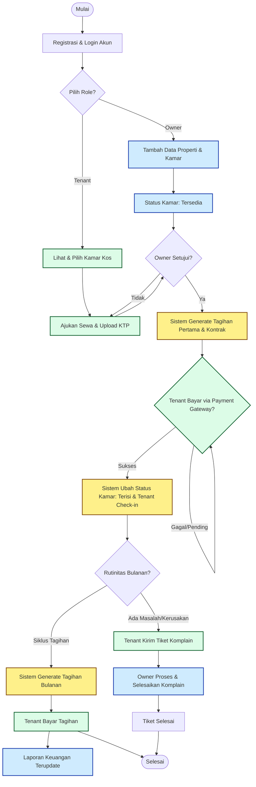

# Product Requirement Document (PRD)
## Sistem Manajemen Kos-Kosan (KosHub)

**Versi:** 1.0  
**Tanggal:** 11 Juli 2026  
**Status:** Draft  
**Penulis:** Product Team  

---

### 1. Latar Belakang & Analisis Masalah
Manajemen kos-kosan secara konvensional seringkali menghadapi berbagai kendala operasional, seperti pencatatan pembayaran yang tidak teratur, kesulitan dalam memantau kamar yang kosong, komunikasi yang terhambat antara pemilik dan penghuni, serta tidak adanya sistem sentral untuk pelaporan kerusakan fasilitas. 

**KosHub** hadir sebagai solusi platform digital terintegrasi untuk mendigitalisasi seluruh ekosistem manajemen kos-kosan, memberikan kemudahan bagi pemilik kos (Owner/Admin) dalam mengelola properti dan memberikan kenyamanan bagi Penghuni (Tenant) dalam bertransaksi serta berinteraksi.

---

### 2. Tujuan Produk
* **Efisiensi Operasional:** Mengotomatiskan pencatatan tagihan, status kamar, dan pembukuan keuangan.
* **Transparansi Transaksi:** Memberikan kemudahan pembayaran digital bagi penghuni dan penarikan dana otomatis bagi pemilik.
* **Meningkatkan Komunikasi:** Menyediakan kanal digital resmi untuk pengajuan keluhan, pengumuman, dan manajemen kontrak.

---

### 3. Pengguna Target (User Persona)
1. **Pemilik Kos / Admin (Owner):** Mengelola banyak kamar/properti, melacak pendapatan, menyetujui penghuni baru, dan memantau komplain.
2. **Penghuni Kos (Tenant):** Melakukan pembayaran sewa, melihat riwayat tagihan, melaporkan kerusakan fasilitas, dan menerima pengumuman.

---

### 4. Lingkup Fitur (Feature Scope)

#### 4.1. Modul Autentikasi & Profil
* Registrasi dan Login (Email/Nomor HP/Google Auth).
* Verifikasi Identitas (KTP untuk Tenant, Sertifikat Properti/Verifikasi Mandiri untuk Owner).

#### 4.2. Modul Manajemen Kamar & Properti (Sisi Owner)
* Menambahkan properti kos baru (alamat, fasilitas umum).
* Menambahkan kamar (nomor kamar, tipe/kelas, harga, fasilitas kamar, foto).
* Mengubah status kamar secara manual atau otomatis (Tersedia, Terisi, Perbaikan).

#### 4.3. Modul Penyewaan & Kontrak
* Manajemen data penghuni (nama, kontak, tanggal masuk, durasi sewa).
* Pembuatan digital contract / surat perjanjian sewa digital.
* Sistem Check-in dan Check-out penghuni.

#### 4.4. Modul Penagihan & Pembayaran (Billing & Payment Gateway)
* Pembuatan tagihan otomatis setiap bulan sesuai tanggal masuk tenant.
* Integrasi *Payment Gateway* (Virtual Account, E-Wallet, QRIS).
* Notifikasi WhatsApp/Email pengingat tagihan (H-3, H-1, dan Hari-H).
* Pencatatan riwayat pembayaran otomatis jika transaksi sukses.

#### 4.5. Modul Tiket Komplain & Fasilitas
* Tenant dapat membuat tiket komplain (Kategori: Fasilitas Kamar, Fasilitas Umum, Keamanan, Kebersihan) dilengkapi foto/video.
* Owner dapat memperbarui status tiket (Pending, Diproses, Selesai).

#### 4.6. Modul Laporan Keuangan (Dashboard Owner)
* Laporan pemasukan bulanan/tahunan.
* Laporan tunggakan pembayaran.
* Laporan pengeluaran operasional kos.

---

### 5. Flowchart Sistem (Mermaid Diagram)

Berikut adalah visualisasi alur sistem (flowchart) dari proses pendaftaran kos, pemesanan/check-in oleh tenant, hingga proses pembayaran rutin dan komplain.

---

### 6. Persyaratan Non-Fungsional (Non-Functional Requirements)
* **Keamanan Data:** Enkripsi data sensitif (password, foto KTP) menggunakan AES-256.
* **Ketersediaan (Availability):** Sistem harus memiliki uptime minimal 99.9%.
* **Performa:** Waktu respons API maksimal 2 detik untuk pemuatan halaman dashboard data standar.
* **Skalabilitas:** Arsitektur sistem mendukung penambahan jumlah properti dan tenant dalam skala besar secara simultan.

---

### 7. Rencana Rilis & MVP (Minimum Viable Product)
* **Fase 1 (MVP):** Autentikasi dasar, Manajemen Kamar (Owner), Pembayaran Manual/Midtrans VA, Manajemen Tenant Sederhana.
* **Fase 2:** Otomatisasi WhatsApp Reminder, Sistem Komplain/Tiket, Laporan Grafik Keuangan Lanjutan.

