# Diagram Alur Proses Sinkronisasi Transaksi VMS

Dokumen ini menjelaskan alur kerja (*workflow*) sinkronisasi data dari ERPNext (Purchase Receipt, Purchase Order, dan Material Request) ke dalam tabel `vms_transactions` di sistem Vendor Management System (VMS) untuk kebutuhan evaluasi vendor.

## Diagram Alur (Mermaid)

```mermaid
graph TD
    A[Start: VMS Menerima Payload Purchase Receipt] --> B{Looping Setiap Item di PR};
    
    %% Ekstraksi dari PR Induk
    B --> C_Main[Cek Level PR: 'is_return' dan 'return_against'];
    C_Main --> C_Extract[Ekstrak: pr_number, pr_item_id, receipt_date, qty, rejected_qty];
    
    %% Pembentukan Unique Key (Penting untuk menghindari duplikasi)
    C_Extract --> C_Key[Bentuk PK 'name' = pr_number + '-' + pr_item_id];
    
    %% Logika Kualitas (Penerimaan vs Retur)
    C_Key --> C_Ret{Apakah is_return == 1 ?};
    C_Ret -- Ya (Retur) --> C_Ret1[Set: qty_returned = qty, qty_received = 0, qty_rejected = 0];
    C_Ret -- Tidak (Normal) --> C_Ret0[Set: qty_received = qty, qty_rejected = rejected_qty, qty_returned = 0];
    
    %% Tarik PO
    C_Ret1 --> C_Check;
    C_Ret0 --> C_Check[Cek 'purchase_order' pada item PR];
    C_Check -- Jika Null --> Z[Skip / Log: Bukan PR berbasis PO];
    C_Check -- Jika Ada --> D[API Call #1: GET Purchase Order];
    
    %% Ekstraksi dari PO
    D --> E{Cari item di PO yg cocok dg 'purchase_order_item'};
    E --> F[Ekstrak: po_number, po_item_id, vendor_id, item_code, actual_price, scheduled_date];
    F --> F_Check[Cek 'material_request' pada item PO];
    
    %% Ekstraksi Material Request
    F_Check -- Jika Null --> H[Set: mr_number = NULL, mr_approved_date = NULL];
    F_Check -- Jika Ada --> G[API Call #2: GET Material Request];
    G --> G_Logic[Filter 'material_request_penanggungjawab' status='Setuju'];
    G_Logic --> G_Max[Ambil 'ditentukan_pada' dari 'idx' Terbesar];
    G_Max --> G_Extract[Set mr_number, mr_item_id, mr_approved_date];
    
    %% DB Insert
    H --> I;
    G_Extract --> I[Gabungkan Data PR, PO, MR];
    I --> I_DB[Query DB internal VMS: Cari Harga Anggaran berdasarkan item_code];
    I_DB --> J[Validasi & Assign 'budget_price_used'];
    J --> K[INSERT ke tabel 'dev_vms.vms_transactions'];
    
    %% Loop check
    K --> L{Masih ada item PR lain dalam payload?};
    L -- Ya --> B;
    L -- Tidak --> M[End: Transaksi tersimpan. Siap agregasi Skor Evaluasi];
    Z --> L;

    classDef process fill:#f9f9f9,stroke:#333,stroke-width:2px;
    classDef quality fill:#ffebee,stroke:#e53935,stroke-width:2px;
    classDef logic fill:#fff3e0,stroke:#fb8c00,stroke-width:2px;
    classDef highlight fill:#e3f2fd,stroke:#1565c0,stroke-width:2px;
    
    class C_Ret,C_Ret1,C_Ret0 quality;
    class C_Key highlight;
```

## Penjelasan Logika Pemrosesan

1. **Pembuatan Kunci Unik (Node Biru):** 
   Langkah krusial untuk mencegah duplikasi data adalah menggabungkan `pr_number` dan `pr_item_id` menjadi satu *string* unik untuk disimpan di kolom `name` (Primary Key). 
2. **Manajemen Kualitas (Node Merah):** 
   Sistem mengecek `is_return` untuk membedakan antara kedatangan barang baru (mencatat penolakan di tempat via `rejected_qty`) dan pengembalian barang cacat (mencatat retur via `qty` yang dikonversi ke `qty_returned`).
3. **Pencarian Waktu Approval (Node Oranye):** 
   Sistem mencari tanggal `ditentukan_pada` dengan status **Setuju** dan urutan approval (`idx`) tertinggi dari *array* Material Request untuk dijadikan acuan valid menghitung SLA *Delivery Time*.
